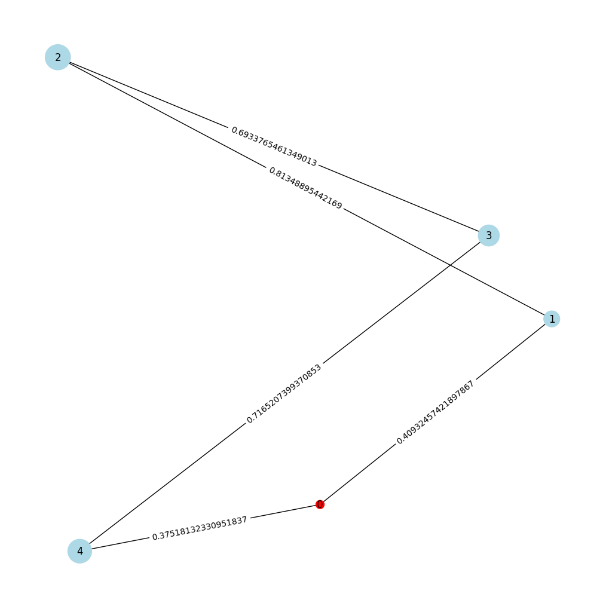

Hi!\
The solution for the project uses simulated annealing with a bit of clever ideas that was part mine and part mine as well with a little help from gpt :)

## The Idea
I will use the following graph to illustrate the idea of my solution

the first idea that came to my mind is that I want to model the path as a simple list from 1 to x, so for example, for the graph here i want to have a list like: [1,2,3,4] and then test putting zeros in the middle (return to base trip) so the final solution can be something like [0,1,2,0,3,4] or whatever order we get using SA.

now when i need to calculate the cost of the part [0,3] it will be = Cost(0,4)+Cost(4,3).\
this means that i will need a short path algorithm to handle that case, so i used dijkstra.

this will be tedious if each time we need to calculate the cost from a point to another that have some points in between we will have to loop through the path segments, so i needed to do some simplifications for the cost.

my simplification was to make the cost in the following way:\
**Cost(X,Y) = ∑d + (w * alpha)beta * ∑dbeta**\
the d here is the distance between each point between X and Y
this allowed me to pre calculate the ∑d and ∑dbeta values using the dijkstra algorithm and read them directly from a dictionary.

then I need to start checking if it's better to move to the base after each segment of the path or should i keep going, this way i will know if i should take the gold from multiple cities at once or no, this is the job of the function called (**splitPermutation**)

so in few words the simulated annealing algorithm is responsible for giving me a permutation of cities (ex: [4,3,2,1]) and then i take that and i try to segment the path in pieces and see if the cost gets smaller than just getting all the gold in one go, if it's cheaper to go back then go back, otherwise continue, when done the solution cost is compared as usual and sa takes back control to find another permutation.

## The Results:

I was able to see marginal improvements over the baseline when beta was sat to 1 (very tiny improvements, almost none)

while i was able to see a surprising improvement over the baseline when a higher beta was used! (in some runs over 16% reduction in the cost!).

|problem|baseline result|my result|improvement (%)|
|--|--|--|--|
|cities:100, edges=1095 alpha=1, beta=1|25266.40|25258.65|0.03065|
|cities:100, edges=1095 alpha=2, beta=1|50425.30|50415.76|0.01892|
|cities:100, edges=1095 alpha=1, beta=2|5334401.92|4994137.43|6.37868|
|cities:100, edges=4950 alpha=1, beta=1|18266.18|18263.59|0.01420|
|cities:100, edges=4950 alpha=2, beta=1|36457.91|36456.12|0.00490|
|cities:100, edges=4950 alpha=1, beta=2|5404978.08|4516799.71|16.43259|
|cities:1000, edges=100958 alpha=1, beta=1|195402.95|195398.56|0.00224|
|cities:1000, edges=100958 alpha=2, beta=1|390028.72|390026.47|0.00057|
|cities:1000, edges=100958 alpha=1, beta=2|37545927.70|32279041.91|14.02784|
|cities:1000, edges=499500 alpha=1, beta=1|192936.23|192923.20|0.00675|
|cities:1000, edges=499500 alpha=2, beta=1|385105.64|385092.99|0.00328|
|cities:1000, edges=499500 alpha=1, beta=2|57580018.86|53713461.38|6.71510|

also the number of edges had an impact, as direct connections between cities made it easier to combine the gold of more cities and return back to the base without having to take longer routes, meaning less trips to the base.

## Some notes:
* the 1000 cities problem takes 20 mins or more, this is mostly because of the huge amount of calculations that happen in the nested loop in the (**splitPermutation**) function.

* for simulated annealing, the neighbor generation was done using swap and inversion mutation, very simple! :)